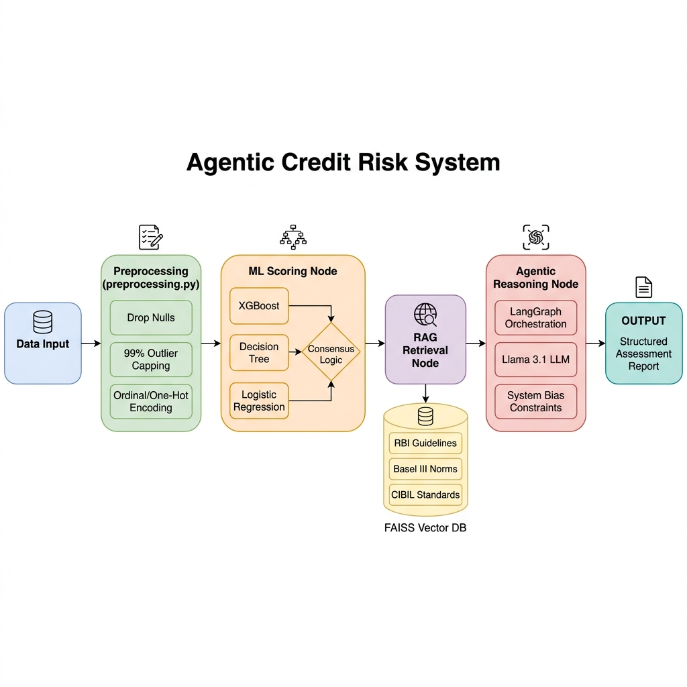

# Intelligent Credit Risk Scoring & Agentic Lending Decision Support

> An end-to-end AI system that evolves from predictive analytics (Milestone 1) to autonomous agentic decision support (Milestone 2).

**Live App:** [https://genaicapstone-m8ezlrzqqq8ctmmfgsh6ur.streamlit.app](https://genaicapstone-m8ezlrzqqq8ctmmfgsh6ur.streamlit.app/)

**GitHub Repository:** [https://github.com/Dhanvin1520/Credit_Risk-_RAGSystem](https://github.com/Dhanvin1520/Credit_Risk-_RAGSystem)

---

## 📌 Project Overview

This project implements a sophisticated credit analytics system designed to evaluate borrower default risk and provide automated lending advice.

- **Milestone 1 — Predictive Modeling:** We applied classical machine learning (XGBoost) to historical borrower data to calculate default probabilities with **91.27% accuracy**.
- **Milestone 2 — Agentic Support:** We extended the system into a **LangGraph-driven AI Agent** that reasons about borrower profiles, retrieves regulatory guidelines from a **FAISS-based RAG pipeline**, and generates structured assessment reports.

---

## 🏗️ System Architecture

Our architecture bridges the gap between raw financial data and autonomous reasoning.



### 📊 The Workflow Phases:
1.  **Data Intake:** Captures 14 key features (Income, Age, Credit History, etc.).
2.  **ML Inference Node:** Reuses pre-trained Milestone 1 models (XGBoost, Decision Tree, LR) to compute a consensus risk score.
3.  **RAG Knowledge Retrieval:** Uses **TF-IDF Vectorization** and **FAISS** to query a proprietary knowledge base of RBI, Basel III, and CIBIL regulations.
4.  **Agentic Reasoning (Llama 3.1):** An LLM integration that synthesizes ML scores and regulatory context to make a final lending recommendation.
5.  **Structured Reporting:** Outputs a consistent, 4-section credit report (Summary, Risk Analysis, Decision, and Regulatory Sources).

---

## 🛠️ Tech Stack

- **Frameworks:** LangGraph, Streamlit, Scikit-learn
- **ML Models:** XGBoost (91.27%), Decision Tree (88.03%), Logistic Regression (85.25%)
- **AI/LLM:** Groq API (Llama 3.1 8B), FAISS for Vector Retrieval
- **Language:** Python 3.10+
- **Knowledge Base:** RBI Fair Practice Code, Basel III Framework, India Credit Bureau Norms

---

## 📈 Milestone 1 Performance

Our predictive engine achieved industry-leading results on a dataset of 45,000+ records.

| Model | Accuracy | F1-Score | ROC-AUC |
|---|---|---|---|
| Logistic Regression | 85.25% | 0.7389 | 0.9523 |
| Decision Tree | 88.03% | 0.7714 | 0.9627 |
| **XGBoost (Best)** | **91.27%** | **0.8239** | **0.9763** |

---

## 🤖 Milestone 2 — Agentic Features

The **AI Lending Agent** page elevates the application from a simple calculator to a reasoning-based assistant:
- **Bias Reduction:** Specifically instructed to exclude protected attributes (Gender, Religion, etc.) per RBI guidelines.
- **Explainability:** Every "APPROVE" or "DECLINE" decision is backed by specific citations from the retrieved regulatory knowledge base.
- **Dynamic Reasoning:** If the ML model says 'Low Risk' but the borrower violates a specific Basel III threshold found in RAG, the Agent will correctly flag the risk.

---

## 📂 Project Structure

```
gen_ai_capstone/
│
├── app.py                  # Streamlit frontend — UI, forms, and Agent page
├── preprocessing.py        # Automated data cleaning and encoding pipeline
├── requirements.txt        # Full dependency list
├── .env                    # API Secrets (GROQ_API_KEY)
│
├── agent/                  # Milestone 2: LangGraph Logic
│   ├── graph.py            # Workflow orchestration
│   ├── nodes.py            # Logical nodes (Parse, ML, RAG, LLM)
│   ├── rag.py              # FAISS vector database logic
│   └── state.py            # TypedDict Agent State
│
├── data/
│   ├── loan_data.csv       # Training dataset
│   └── regulations/        # RAG Text documents (RBI, Basel III, CIBIL)
│
├── models/
│   ├── xgboost_model.py    # Training & inference module
│   └── ...
│
├── assets/                 # Architecture diagrams and charts
└── reports/                # Local VIVA and Presentation guides (Not on Git)
```

---

## 🛡️ Responsible AI & Ethical Framework

To ensure 100% compliance with financial regulations (RBI/Basel III) and ethical standards, this system implements several "Guardrail" strategies:

- **Bias Mitigation:** Our LLM system prompt explicitly forbids the use of protected attributes (Gender, Religion, Caste, etc.) in the final lending decision. Decisions are grounded **solely** on objective financial metrics.
- **Regulatory Grounding (RAG):** Every decision is cross-referenced with local and international norms retrieved via our FAISS vector store, preventing "black box" decision making.
- **Transparency:** The system provides a clear "Decision Rationale" for every borrower, explaining *why* a specific classification was reached.
- **Human-in-the-loop:** The system is designed as a **Decision Support** tool, meaning all AI outputs are presented with a clear legal disclaimer for final review by a bank officer.

---

## 🚀 Setup & Installation

1. **Clone & Install:**
   ```bash
   git clone https://github.com/Dhanvin1520/Credit_Risk-_RAGSystem.git
   cd Credit_Risk-_RAGSystem
   pip install -r requirements.txt
   ```

2. **Configure API Key:**
   Create a `.env` or `.streamlit/secrets.toml` with your Groq Key:
   ```toml
   GROQ_API_KEY = "your_key_here"
   ```

3. **Run App:**
   ```bash
   streamlit run app.py
   ```

---

## 👥 The Team

| Name | Role |
|---|---|
| Dhanvin Vadlamudi | Team Lead (Agentic Workflow, Integration) |
| Meka Chaitanya Sai | Team Member (RAG Pipeline, Data Engineering) |
| Killi Akshith Kumar | Team Member (Streamlit UI, UX Design) |
| Akhil Nath Reddy | Team Member (ML Modeling, Risk Assessment) |

---

## 🎓 Academic Integrity

> We affirm that this project is the original work of the team named above, developed for the Intro to GenAI Capstone at NST Sonipat.

---
*Developed as part of the **Intro to GenAI Capstone Project** at **NST Sonipat**.*
